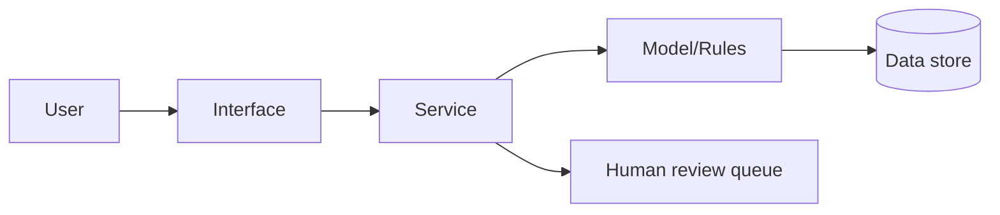

# Architecture and Technical Design

## 1. Overview
Purpose, users, system context diagram (Mermaid or image).

## 2. Components
| Component | Responsibility | Tech | Owner |
|---|---|---|---|

## 3. Data flow
Inputs -> processing -> outputs; where personal data could appear; retention and deletion.

## 4. Models and logic
Model type, training data, prompts (if LLM), guardrails, fallback/abstention behaviour.

## 5. Human oversight points
Where a person reviews, overrides or approves; what happens if no human is available.

## 6. Security and privacy design
Threat model summary (STRIDE table), authentication, access control, secrets handling, logging/audit, encryption in transit/at rest, dependency policy.

| Threat | Component | Mitigation | Residual risk |
|---|---|---|---|

## 7. Deployment and operations
Environments, how to run locally, resource needs, offline behaviour, monitoring.

## 8. Scalability and sustainability
Cost drivers, scaling limits, maintenance plan, open-source/handover path.

## 9. Decisions log (ADR)
| Date | Decision | Alternatives | Reason |
|---|---|---|---|
